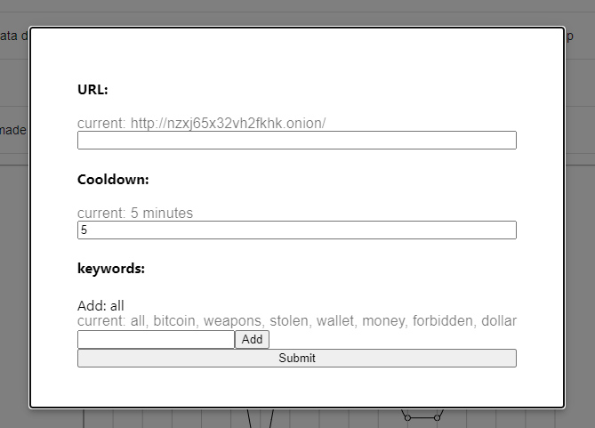
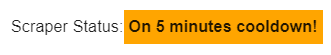

#  Omri Zilberstein - Dark Web Scraper

In this project I created a Dark Web Scraper and dashboard, using React.js, Express, Python 3.8, MongoDB database and Elasticsearch database. \
The scraped data is indexed in Elasticsearch for quick text querying and users data is saved in MongoDB. \
The app is dockerized and can be run with the docker-compose up. \
The app has a Dashboard, which presents that data collected, analtyics and configuration options for the scraper. \
Used Material-UI components to design the page and recharts for the charts.


## Database

- The app is using MongoDB database placed in Atlas Cloud.
- The app is using Elasticsearch database.
- Elastic used for text querying and analytics.
- MongoDB used for Users data.

## Backend

- The Express app located in the path `server/app.js` and exports the `index` object (`module.exports = app;`).
- The server runs on port `8080` serves the react app on `http://localhost:8080/` and has 2 main routes, Users and Data. It exposes those API endpoints:
  - data:
    - [GET] api/data/ Get all scraped data.
    - [GET] api/data/\_search/ Search for a certain item in Elasticsearch.
    - [GET] api/data/\_search/ Get how many items includes a certain label.
    - [GET] api/data/\_status/ Gets the current status of the scraper.
    - [GET] api/data/\_bins/[:page] Infinite scroller endpoint for data.
    - [GET] api/data/\_sentiment/ Analyzes the sent data for sentiment.
    - [POST] api/data/\_status/ Sets the scraper status.
    - [POST] api/data/ Posts new data in bulk.
  - user:
    - [GET] api/user/\_alerts/ Get current user seen bins.
    - [GET] api/user/\_all/ Get all users.
    - [GET] api/user/\_config/ Get current users config.
    - [PUT] api/user/\_alerts/ Updates seen bins.
    - [PUT] api/user/\_config/ Updates scrapers config.
    - [POST] api/user/\_new\_/ Creates new user.

## Client

- The app title is `Dark Web Scraper`.
- The server serves the app and shows all of the bins the were collected drom the dark web,scraper status, alerts of new data collected, analytics about the data, configuration options and more.
- The app has configuration form, where you can edit the python scrapers form.
  
- The app shows the scraper's status.
  - on:
  - 
  - off:
  - 
  - error:
  - 
  - cooldown menu:
  - 
- The app has table that shows all data, where you can mark data as seen, restore all the data, show all, and omni-search from all scrapped data.
  - 
- The app is responsive:
  - 

## Scraper

- The scraper is written in Python.
- There are 2 option, scrape using Selenium or scrape using BS4.
- If ran in docker, it only supports BS4.
- The scraper get his config from the Node.JS server, where it gets keywords to search, cooldown and url.
- After it finishes scrapping, it updates the server and sends all newly scrapped data.

## Docker

- The app is dockerized, you can run it on a docker platform with:

```bash
  docker-compose up
```

- The app has Elasticsearch service, Server service - Node.JS, Scraper - Python service and a Proxy service.
- Docker will build a network and connect all the services, it offers hot-reload so the code can be edited live.
